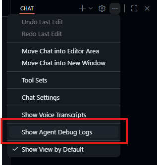
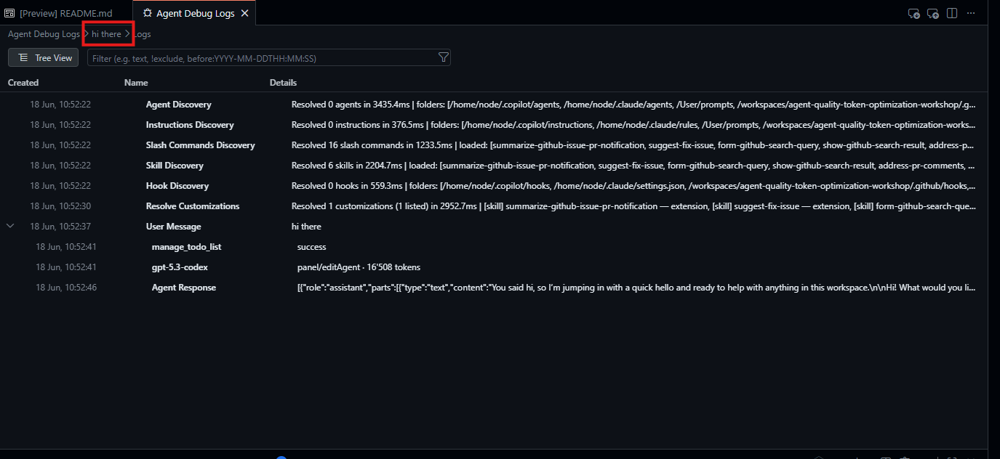
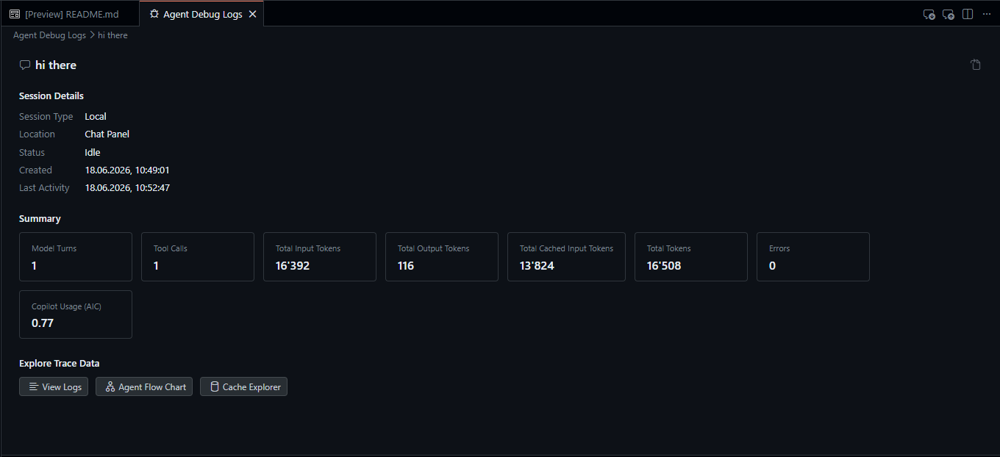

# VS Code · Module 00 — Setup & ROI Mindset 🟢

**Goal:** get Copilot working in VS Code, run the sample app, and adopt the workshop's core principle before you write a single prompt.

> **Don't minimize tokens, maximize their value.** Better quality → fewer retries → lower total cost.

---

## 1. Verify Copilot

1. Open the Chat view: `Ctrl+Alt+I` (Windows/Linux) or `⌃⌘I` (macOS).
2. Confirm you can see:
   - the **mode** dropdown: **Ask · Plan · Agent**
   - the **model picker** (e.g. "Auto", plus named models)
3. In **Ask** mode, type: `What can you help me with in this workspace?` and confirm you get a response.

✅ **Checkpoint:** you received a reply and can switch between Ask/Plan/Agent.

### 1.1 Verify you can see Agent Debug Logs

After your first conversation, click `Show Agent Debug Logs` in the three-dot menu next to the gear icon in the upper-right corner:



You should see a window with the logs. Click the conversation title:



Now you can see metrics such as turns, token usage, tool calls, etc.



---

## 2. Run the sample app

In a VS Code terminal (`` Ctrl+` ``):

```bash
cd sample-app
npm install
npm run build
npm test
```

You should see the build succeed and **one test fail on purpose** (`includes tasks exactly equal to the threshold`). That failing test is your first quality signal, don't fix it yet.

✅ **Checkpoint:** 3 tests pass, 1 fails.

---

## 3. Adopt the ROI mindset

Before each task in this workshop, pause and ask:

1. **What's the smallest correct context** for this task? (not the whole repo)
2. **What does "done" look like?** (a stop condition the agent can check)
3. **Which model** fits the difficulty?
4. **Can a test/lint verify it** instead of me eyeballing it?

This 10-second habit is the highest-ROI thing in the whole workshop.

---

## 4. Set up your scorecard

Create a scratch file `my-scorecard.md` at the repo root (it's just for you). Copy the scorecard template from the [track README](README.md#the-scorecard-use-it-in-every-module). You'll fill one in per module.

---

## VS Code tips that save tokens from day one

- Start a **new Chat** between unrelated tasks, a fresh session is a free context reset.
- Add **only the files that matter**, not whole folders.
- Use **Ask** mode for thinking and **Agent** mode for doing, don't burn Agent turns on a question.

---

## Expected outcome

- Copilot Chat works and you can switch modes/models.
- The sample app builds, with exactly one intentional failing test.
- You have a scorecard ready and the ROI questions in mind.

➡️ Next: [01 — Why quality matters](01-why-quality-matters.md)
